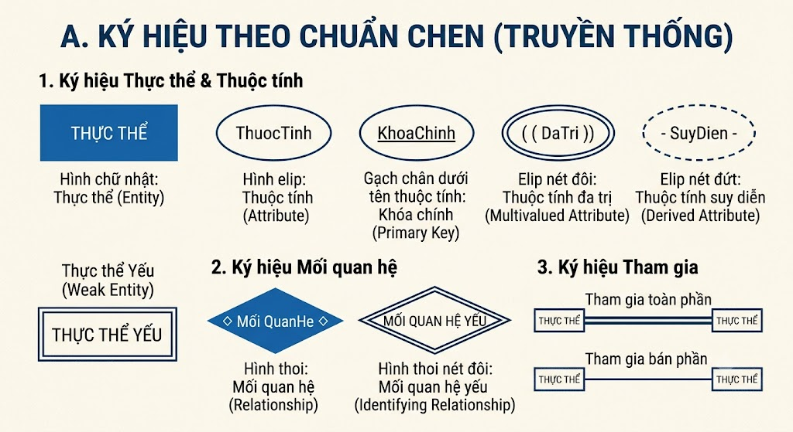
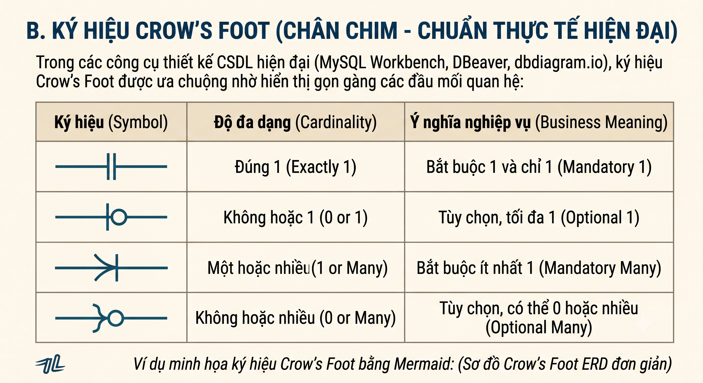
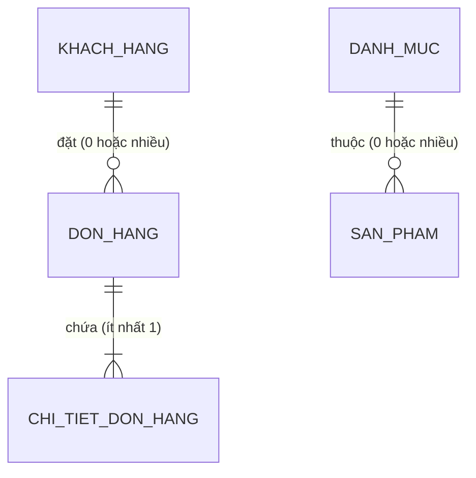
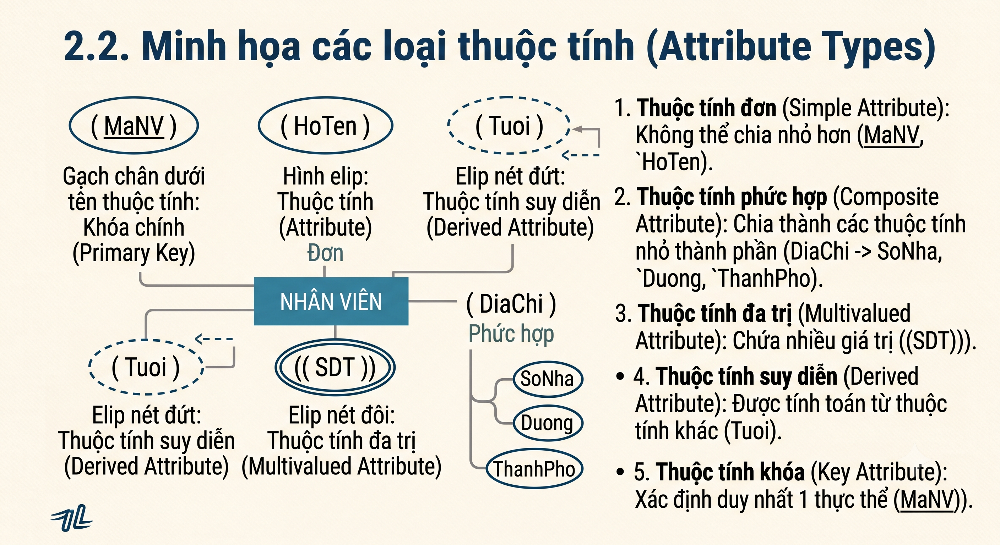
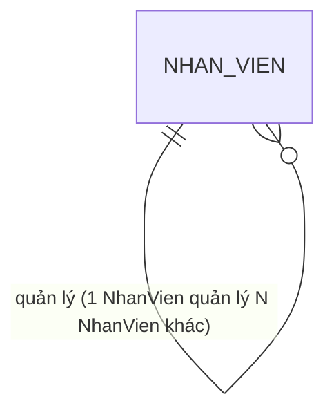
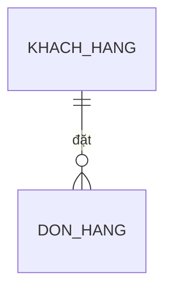
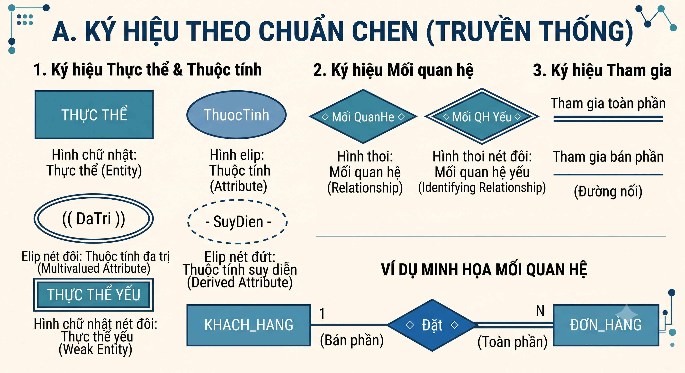
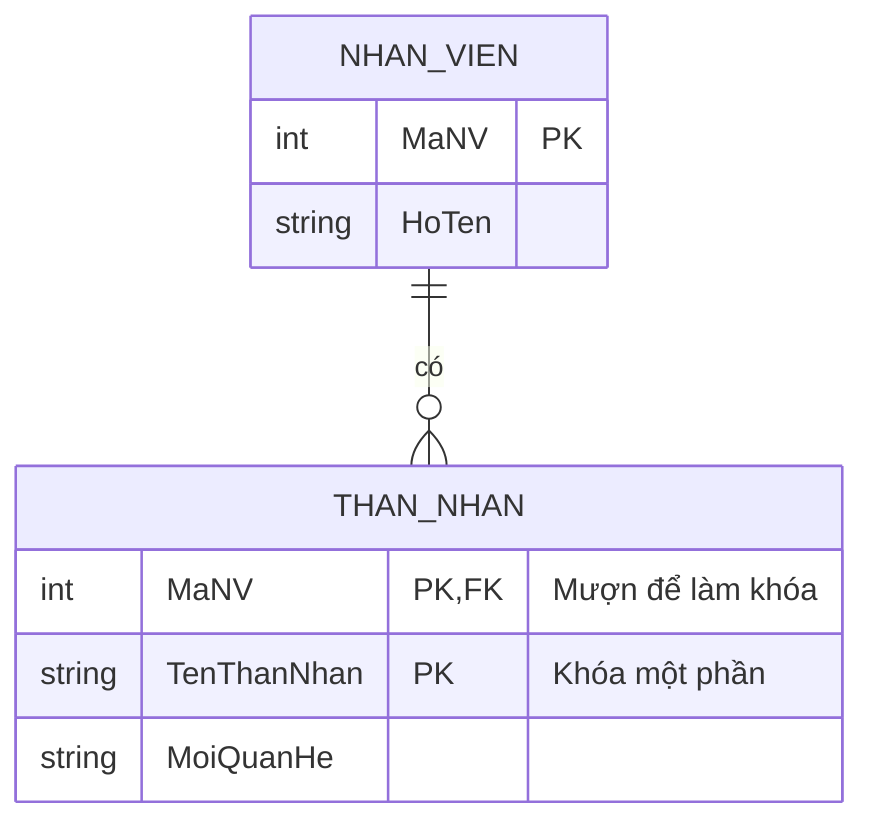
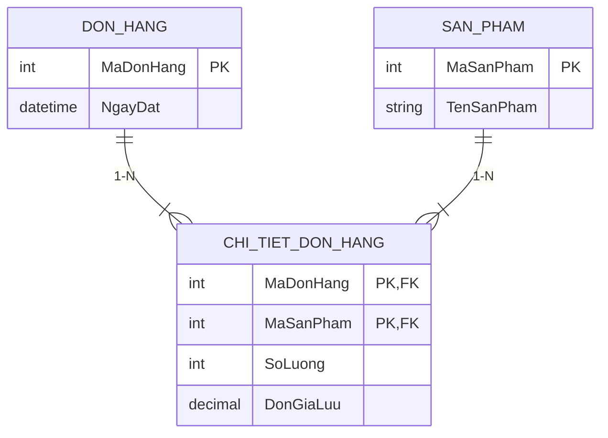
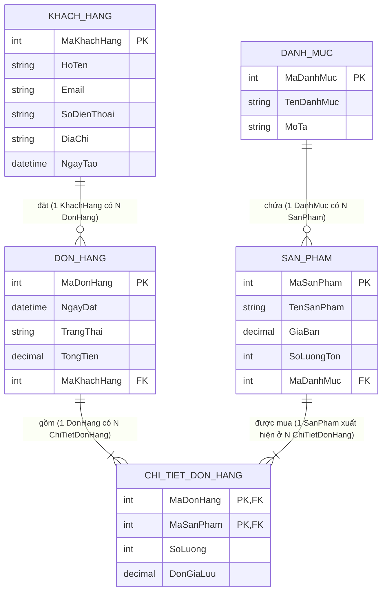

# BUỔI 2: CƠ BẢN VỀ THIẾT KẾ CƠ SỞ DỮ LIỆU & CHUẨN HÓA DỮ LIỆU

> **Tài liệu học tập & Chuẩn bị trước buổi học CLB ProPtit**  
> **Chủ đề:** Từ Yêu cầu Nghiệp vụ → Lược đồ E-R (ERD) → Mô hình Quan hệ → Chuẩn hóa 3NF → Cài đặt trên MySQL.

---

## MỤC LỤC

1. [Tổng quan & Quy trình thiết kế CSDL](#1-tổng-quan--quy-trình-thiết-kế-csdl)
2. [Mô hình Thực thể - Quan hệ (E-R Diagram - ERD)](#2-mô-hình-thực-thể---quan-hệ-e-r-diagram---erd)
3. [Mô hình dữ liệu Quan hệ (Relational Model) & Quy tắc chuyển đổi](#3-mô-hình-dữ-liệu-quan-hệ-relational-model--quy-tắc-chuyển-đổi)
4. [Lý thuyết Phụ thuộc hàm & Chuẩn hóa dữ liệu (1NF, 2NF, 3NF, BCNF)](#4-lý-thuyết-phụ-thuộc-hàm--chuẩn-hóa-dữ-liệu-1nf-2nf-3nf-bcnf)
5. [Cài đặt, Cấu hình và Sử dụng MySQL](#5-cài-đặt-cấu-hình-và-sử-dụng-mysql)
6. [Thực hành Case Study từ A-Z: Hệ thống Quản lý Bán hàng E-Commerce](#6-thực-hành-case-study-từ-a-z-hệ-thống-quản-lý-bán-hàng-e-commerce)
7. [Bài tập thực hành & Checklist hoàn thành](#7-bài-tập-thực-hành--checklist-hoàn-thành)

---

## 1. Tổng quan & Quy trình thiết kế CSDL

### 1.1. Tại sao phải thiết kế CSDL bài bản?

Trong thực tế phát triển phần mềm, nếu thiết kế CSDL sai hoặc kém tối ưu từ đầu, hệ thống sẽ gặp phải các hậu quả nghiêm trọng:
- **Dư thừa dữ liệu (Data Redundancy):** Lưu một thông tin ở nhiều nơi gây lãng phí bộ nhớ và khó đồng bộ.
- **Bất thường dữ liệu (Data Anomalies):**
  - *Bất thường khi thêm (Insertion Anomaly):* Không thể thêm dữ liệu mới nếu thiếu một thông tin chưa liên quan.
  - *Bất thường khi sửa (Update Anomaly):* Sửa thông tin ở một nơi nhưng quên sửa ở nơi khác dẫn đến dữ liệu mâu thuẫn.
  - *Bất thường khi xóa (Deletion Anomaly):* Xóa một dòng dữ liệu làm mất luôn thông tin quan trọng khác không cố ý xóa.
- **Hiệu năng kém (Poor Performance):** Truy vấn chậm, khó đánh chỉ mục (Index), tràn bộ nhớ.

> [!IMPORTANT]
> Thiết kế CSDL là khâu nền móng. Chi phí sửa lỗi thiết kế CSDL ở giai đoạn sản xuất (Production) lớn gấp hàng trăm lần so với sửa lỗi ở giai đoạn thiết kế trên giấy!

---

### 1.2. Quy trình thiết kế CSDL 5 bước chuẩn quốc tế

```
┌─────────────────────────┐
│ 1. Khảo sát Yêu cầu     │ (Requirement Analysis)
└───────────┬─────────────┘
            │
┌───────────▼─────────────┐
│ 2. Thiết kế Ý niệm       │ (Conceptual Design - ERD)
└───────────┬─────────────┘
            │
┌───────────▼─────────────┐
│ 3. Thiết kế Luận lý     │ (Logical Design - Relational Schema)
└───────────┬─────────────┘
            │
┌───────────▼─────────────┐
│ 4. Chuẩn hóa Dữ liệu    │ (Normalization - 1NF, 2NF, 3NF)
└───────────┬─────────────┘
            │
┌───────────▼─────────────┐
│ 5. Thiết kế Vật lý      │ (Physical Design - MySQL DDL Script)
└─────────────────────────┘
```

| Giai đoạn | Mục tiêu chính | Đầu ra (Deliverables) | Công cụ hỗ trợ |
|---|---|---|---|
| **1. Khảo sát yêu cầu** | Thu thập các quy tắc nghiệp vụ (Business rules), thực thể, báo cáo mong muốn. | Tài liệu tả nghiệp vụ, danh sách chức năng | Word, Notion, Jira |
| **2. Thiết kế ý niệm** | Xây dựng sơ đồ tổng quan độc lập với bất kỳ RDBMS nào. | Lược đồ E-R (ERD) | Draw.io, Lucidchart, ERD Lab |
| **3. Thiết kế luận lý** | Chuyển ERD sang mô hình bảng, định nghĩa các khóa chính (PK) và khóa ngoại (FK). | Lược đồ quan hệ (Relational Schema) | dbdiagram.io, QuickDBD |
| **4. Chuẩn hóa** | Phân tích phụ thuộc hàm, loại bỏ dư thừa dữ liệu đến dạng chuẩn 3NF/BCNF. | Danh sách các bảng đã được chuẩn hóa | Bảng kiểm tra chuẩn hóa |
| **5. Thiết kế vật lý** | Cài đặt thực tế trên hệ quản trị cụ thể (MySQL), chọn kiểu dữ liệu, index. | File SQL chứa các lệnh `CREATE TABLE` | MySQL Workbench, DBeaver |

---

## 2. Mô hình Thực thể - Quan hệ (E-R Diagram - ERD)

Mô hình ERD (Entity-Relationship Diagram) giúp mô hình hóa dữ liệu ở mức ý niệm (Conceptual Level) thông qua các thực thể và mối liên kết giữa chúng.

### 2.1. Các ký hiệu và thành phần cơ bản của ERD

#### A. Ký hiệu theo chuẩn Chen (Truyền thống)

```
        ┌──────────────┐               (  ThuocTinh  )
        │   THỰC THỂ   │               ( <u>KhoaChinh</u> )
        └──────────────┘               ( ( DaTri  ) )
         (Hình chữ nhật)               (- SuyDien  -)
                                       (  Hình elip  )

               ◇                       ═════════════════
            /  Mối  \                  Tham gia toàn phần
            \QuanHe /                   ─────────────────
               ◇                       Tham gia bán phần
          (Hình thoi)                    (Đường nối)
```




- **Hình chữ nhật:** Thực thể (Entity) — Đối tượng cần lưu trữ.
- **Hình elip:** Thuộc tính (Attribute) — Đặc điểm mô tả đối tượng.
- **Hình thoi:** Mối quan hệ (Relationship) — Liên kết giữa các thực thể.
- **Gạch chân dưới tên thuộc tính:** Thuộc tính Khóa chính (Primary Key).
- **Elip nét đôi:** Thuộc tính đa trị (Multivalued Attribute).
- **Elip nét đứt:** Thuộc tính suy diễn (Derived Attribute).
- **Hình chữ nhật nét đôi:** Thực thể yếu (Weak Entity).
- **Hình thoi nét đôi:** Mối quan hệ yếu (Identifying Relationship).

---

#### B. Ký hiệu Crow's Foot (Chân chim - Chuẩn thực tế hiện đại)

Trong các công cụ thiết kế CSDL hiện đại (MySQL Workbench, DBeaver, dbdiagram.io), ký hiệu Crow's Foot được ưa chuộng nhờ hiển thị gọn gàng các đầu mối quan hệ:



**Ví dụ minh họa ký hiệu Crow's Foot bằng Mermaid:**



---

### 2.2. Minh họa các loại thuộc tính (Attribute Types)



1. **Thuộc tính đơn (Simple Attribute):** Không thể chia nhỏ hơn (`MaNV`, `GiaBan`).
2. **Thuộc tính phức hợp (Composite Attribute):** Chia thành các thuộc tính nhỏ thành phần (`DiaChi` $\rightarrow$ `SoNha`, `Duong`, `ThanhPho`).
3. **Thuộc tính đa trị (Multivalued Attribute):** Chứa nhiều giá trị cho một thực thể (`((SDT))`, `((BangCap))`).
4. **Thuộc tính suy diễn (Derived Attribute):** Được tính toán từ thuộc tính khác (`(-Tuoi-)` suy từ `NgaySinh`).
5. **Thuộc tính khóa (Key Attribute):** Xác định duy nhất 1 thực thể (`(<u>MaNV</u>)`).

---

### 2.3. Bậc của mối quan hệ (Degree of Relationship) & Sơ đồ minh họa

#### A. Quan hệ Bậc 1 (Unary / Recursive Relationship - Quan hệ tự thân)
Một thực thể liên kết với chính nó.

```
                  ┌──────────────┐
                  │   NHÂN VIÊN  │
                  └──────┬───────┘
                     1   │   │ N
                  ┌──────┴───▼──────┐
                  │   Quản lý       │ (Relationship)
                  └─────────────────┘
```



### Bảng: `NHAN_VIEN`

| MaNV (PK) | HoTen | ChucVu | MaQuanLy (FK -> MaNV) | Ghi chú |
| :--- | :--- | :--- | :--- | :--- |
| **NV01** | Nguyễn Văn An | Giám đốc | `NULL` | Cấp cao nhất, không có quản lý |
| **NV02** | Trần Thị Bình | Trưởng phòng | **NV01** | Quản lý bởi ông An (NV01) |
| **NV03** | Lê Văn Cường | Nhân viên | **NV02** | Quản lý bởi bà Bình (NV02) |
| **NV04** | Phạm Thị Dung | Nhân viên | **NV02** | Quản lý bởi bà Bình (NV02) |

---

#### B. Quan hệ Bậc 2 (Binary Relationship)
Liên kết giữa 2 thực thể khác nhau (Chiếm > 90% thực tế).

```
 ┌──────────────┐    1                N    ┌──────────────┐
 │  KHACH_HANG  ├─────────◇ Đặt ◇─────────┤   ĐƠN_HÀNG   │
 └──────────────┘                          └──────────────┘
```


Ví dụ: Khách hàng đặt Đơn hàng - Quan hệ 1 : N

### Bảng 1: `KHACH_HANG`

| MaKH (PK) | TenKH | SoDienThoai | DiaChi |
| :--- | :--- | :--- | :--- |
| **KH01** | Hoàng Long | 0912345678 | Hà Nội |
| **KH02** | Minh Thư | 0987654321 | Đà Nẵng |
| **KH03** | Tuấn Anh | 0905123456 | TP. HCM |

### Bảng 2: `DON_HANG`

| MaDH (PK) | NgayDat | TongTien | MaKH (FK -> KHACH_HANG) | Ghi chú |
| :--- | :--- | :--- | :--- | :--- |
| **DH101** | 2026-08-10 | 500.000 | **KH01** | Đơn hàng của Long |
| **DH102** | 2026-08-15 | 1.200.000 | **KH01** | Đơn hàng thứ 2 của Long |
| **DH103** | 2026-08-20 | 350.000 | **KH02** | Đơn hàng của Thư |

---

#### C. Quan hệ Bậc 3 (Ternary Relationship)
Liên kết đồng thời giữa 3 tập thực thể trong một hành động duy nhất

```
                 ┌──────────────┐
                 │ NHÀ CUNG CẤP │
                 └──────┬───────┘
                        │
                        ◇ Cung cấp
                     /     \
   ┌────────────────┐       ┌────────────────┐
   │    SẢN PHẨM    │       │     DỰ ÁN      │
   └────────────────┘       └────────────────┘
```

Ví dụ: Nhà cung cấp cấp Sản phẩm cho Dự án

### Bảng 1: `NHA_CUNG_CAP`

| MaNCC (PK) | TenNCC | DiaChi |
| :--- | :--- | :--- |
| **NCC01** | Công ty Thép Việt | Hà Nội |
| **NCC02** | Xi măng Hà Tiên | Kiên Giang |

### Bảng 2: `SAN_PHAM`

| MaSP (PK) | TenSP | DonViTinh |
| :--- | :--- | :--- |
| **SP01** | Thép cuộn D10 | Tấn |
| **SP02** | Xi măng PCB40 | Bao |

### Bảng 3: `DU_AN`

| MaDA (PK) | TenDA | DiaDiem |
| :--- | :--- | :--- |
| **DA01** | Cầu Nhật Tân | Hà Nội |
| **DA02** | Tòa nhà Landmark | TP. HCM |

### Bảng trung gian liên kết: `CUNG_CAP`

> **Khóa chính kết hợp:** `(MaNCC, MaSP, MaDA)`

| MaNCC (FK) | MaSP (FK) | MaDA (FK) | SoLuong | NgayGiao |
| :--- | :--- | :--- | :--- | :--- |
| **NCC01** | **SP01** | **DA01** | 100 | 2026-08-01 |
| **NCC01** | **SP01** | **DA02** | 250 | 2026-08-05 |
| **NCC02** | **SP02** | **DA01** | 500 | 2026-08-12 |


---

#### D. Tham gia toàn phần (Total) vs Bán phần (Partial)



```
 ┌──────────────┐    1   (Bán phần)       (Toàn phần)  N   ┌──────────────┐
 │  KHACH_HANG  ├────────────◇ Đặt ◇══════════════════════┤   ĐƠN_HÀNG   │
 └──────────────┘                                          └──────────────┘
```
- `KHACH_HANG` **tham gia bán phần** (đường đơn `-`): Một khách hàng mới tạo tài khoản có thể chưa đặt đơn hàng nào.
- `DON_HANG` **tham gia toàn phần** (đường đôi `=`): Một đơn hàng bắt buộc phải gắn liền với một khách hàng.

---

### 2.4. Thực thể yếu (Weak Entity) & Thực thể mạnh (Strong Entity)

- **Thực thể mạnh:** Có khóa chính riêng, tồn tại độc lập.
- **Thực thể yếu:** Không có khóa chính đầy đủ, phụ thuộc vào thực thể mạnh chủ. Mối quan hệ phụ thuộc được gọi là **Identifying Relationship** (Hình thoi nét đôi).

```
 ┌──────────────┐    1                      N   ╔══════════════╗
 │  NHÂN VIÊN   ├═════════◈ Có ◈════════════════╣  THÂN NHÂN   ║
 └──────────────┘                               ╚══════════════╝
  (Thực thể mạnh)                             (Thực thể yếu)
   PK: <u>MaNV</u>                                    Partial Key: - -TenThanNhan- -
```



---

## 3. Mô hình dữ liệu Quan hệ (Relational Model) & Quy tắc chuyển đổi

### 3.1. Các thuật ngữ cốt lõi trong Mô hình Quan hệ

| Thuật ngữ Ý niệm (ERD) | Thuật ngữ Quan hệ (Relational Model) | Thuật ngữ SQL thực tế |
|---|---|---|
| Thực thể (Entity) | Quan hệ (Relation) | Bảng (Table) |
| Thuộc tính (Attribute) | Thuộc tính (Attribute) | Cột (Column / Field) |
| Thể hiện thực thể (Entity Instance) | Bộ (Tuple) | Dòng / Bản ghi (Row / Record) |
| Tập giá trị hợp lệ | Miền giá trị (Domain) | Kiểu dữ liệu & Constraint |
| Khóa chính | Khóa chính (Primary Key - PK) | Primary Key Constraint |

---

### 3.2. 8 Quy tắc chuyển đổi chuẩn từ ERD sang Mô hình Quan hệ

```
┌─────────────────────────────────────────────────────────────────────────┐
│                    QUY TẮC CHUYỂN ĐỔI ERD → RELATIONAL SCHEMA            │
├─────────────────────────────────────────────────────────────────────────┤
│ 1. Thực thể mạnh            ──► Tạo Bảng riêng, PK giữ nguyên.         │
│ 2. Thuộc tính phức hợp      ──► Phân rã thành các cột đơn thành phần. │
│ 3. Thuộc tính đa trị        ──► Tạo Bảng mới (PK + Thuộc tính đó).   │
│ 4. Thực thể yếu             ──► Tạo Bảng mới (PK = PK Owner + Partial).│
│ 5. Quan hệ 1 - 1            ──► Đặt FK ở phía tham gia toàn phần.      │
│ 6. Quan hệ 1 - N            ──► Thêm FK vào phía "Nhiều" (N).           │
│ 7. Quan hệ N - N            ──► Tạo Bảng trung gian chứa 2 FK.        │
│ 8. Quan hệ tự thân (1-N)    ──► Thêm cột FK trỏ về PK chính bảng đó.  │
└─────────────────────────────────────────────────────────────────────────┘
```
# Ví dụ:

## QUY TẮC 1: THỰC THỂ MẠNH
> **Quy tắc:** Tạo bảng riêng, giữ nguyên khóa chính (PK).

* **Lược đồ quan hệ:** `SINH_VIEN` (**<u>MaSV</u>**, TenSV, NgaySinh)

### Bảng: `SINH_VIEN`

| <u>MaSV</u> (PK) | TenSV | NgaySinh |
| :--- | :--- | :--- |
| **SV01** | Nguyễn Văn A | 2004-05-12 |
| **SV02** | Trần Thị B | 2004-09-20 |

* **Bản chất:** Đối tượng tự nó có đầy đủ thông tin độc lập, không phải dựa dẫm vào ai.
* **Ví dụ:** Thực thể `SINH_VIEN` tự có mã định danh `MaSV`, tên, ngày sinh.
* **Giải thích:** Tạo ngay một bảng `SINH_VIEN`, lấy `MaSV` làm Khóa chính (PK) để phân biệt từng dòng dữ liệu.

---

## QUY TẮC 2: THUỘC TÍNH PHỨC HỢP
> **Quy tắc:** Phân rã thành các cột đơn thành phần, bỏ thuộc tính phức hợp cha.

* **Lược đồ quan hệ:** `KHACH_HANG` (**<u>MaKH</u>**, Ho, Ten, SoNha, Duong, ThanhPho)

### Bảng: `KHACH_HANG`

| <u>MaKH</u> (PK) | Ho | Ten | SoNha | Duong | ThanhPho |
| :--- | :--- | :--- | :--- | :--- | :--- |
| **KH01** | Nguyễn | An | 123 | Cầu Giấy | Hà Nội |
| **KH02** | Lê | Bình | 45 | Lê Lợi | TP. HCM |

* **Bản chất:** Trong CSDL quan hệ, mỗi ô dữ liệu chỉ nên chứa **1 giá trị nguyên tử** nhỏ nhất (chuẩn 1NF).
* **Ví dụ:** Thay vì lưu chung một chuỗi `DiaChi: "123 Cầu Giấy Hà Nội"`, ta bóc tách thành 3 cột độc lập: `SoNha` (123), `Duong` (Cầu Giấy), `ThanhPho` (Hà Nội).
* **Giải thích:** Tách ra giúp câu lệnh SQL dễ dàng tìm kiếm và thống kê (ví dụ: `WHERE ThanhPho = 'Hà Nội'`). Nếu để dồn một chuỗi dài thì hệ thống lọc rất chậm và dễ sai sót.

---

## QUY TẮC 3: THUỘC TÍNH ĐA TRỊ
> **Quy tắc:** Tạo bảng mới, khóa chính kết hợp từ PK cha và thuộc tính đa trị đó.

* **Lược đồ quan hệ:**
  * `NHAN_VIEN` (**<u>MaNV</u>**, HoTen)
  * `NV_SODIENTHOAI` (**<u>MaNV</u>**, **<u>SoDienThoai</u>**)

### Bảng: `NV_SODIENTHOAI`

| <u>MaNV</u> (FK) | <u>SoDienThoai</u> |
| :--- | :--- |
| **NV01** | 0912345678 |
| **NV01** | 0987654321 |
| **NV02** | 0905111222 |


* **Bản chất:** Không được nhét nhiều số điện thoại vào cùng 1 ô, cũng không thể tạo cố định `SDT1`, `SDT2`, `SDT3` vì sẽ bị thừa ô trống (`NULL`).
* **Ví dụ:** Nhân viên có thể có nhiều số điện thoại liên lạc -> Tạo bảng riêng `NV_SODIENTHOAI`.
* **Giải thích:** Nhân viên có 10 số điện thoại thì thêm 10 dòng trong bảng phụ, mỗi dòng gồm `MaNV + SoDienThoai` kết hợp làm khóa chính. Bảng `NHAN_VIEN` gốc giữ nguyên vẹn, không bị phình to vô ích.
---


## QUY TẮC 4: THỰC THỂ YẾU
> **Quy tắc:** Tạo bảng mới, PK = PK của thực thể mạnh chủ (Owner PK) + Khóa bộ phận (Partial Key).

* **Lược đồ quan hệ:** `THAN_NHAN` (**<u>MaNV</u>**, **<u>TenThanNhan</u>**, MoiQuanHe, NgaySinh)

### Bảng: `THAN_NHAN`

| MaNV (PK, FK) | TenThanNhan (PK) | MoiQuanHe | NgaySinh |
| :--- | :--- | :--- | :--- |
| **NV01** | Nguyễn Văn Nam | Con | 2015-01-10 |
| **NV01** | Lê Thị Mai | Vợ | 1988-03-25 |
| **NV02** | Trần Văn Nam | Con | 2018-07-15 |

* **Bản chất:** Thực thể này đứng một mình thì vô nghĩa, chỉ tồn tại nhờ "ăn theo" thực thể chính.
* **Ví dụ:** Thông tin con cái/vợ chồng (`THAN_NHAN`) của nhân viên. Nếu chỉ lưu tên "Bé Nam" thì không biết là con của ai trong công ty.
* **Giải thích:** Bảng `THAN_NHAN` bắt buộc phải mượn `MaNV` (của bố/mẹ) làm khóa ngoại (FK), sau đó ghép chung với `TenThanNhan` để tạo thành Khóa chính (PK) hoàn chỉnh. Khi nhân viên nghỉ việc bị xóa, dữ liệu thân nhân cũng tự động bị xóa theo.
---

## QUY TẮC 5: QUAN HỆ 1 - 1
> **Quy tắc:** Đặt FK ở phía tham gia toàn phần (hoặc phía ít `NULL` hơn) kèm ràng buộc `UNIQUE`.

* **Lược đồ quan hệ:**
  * `NHAN_VIEN` (**<u>MaNV</u>**, HoTen)
  * `PHONG_BAN` (**<u>MaPB</u>**, TenPB, TruongPhong_MaNV)

### Bảng: `PHONG_BAN`

| <u>MaPB</u> (PK) | TenPB | TruongPhong_MaNV (FK, UNIQUE) |
| :--- | :--- | :--- |
| **PB01** | Phòng CNTT | **NV01** |
| **PB02** | Phòng Kế toán | **NV02** |


* **Bản chất:** Một người chỉ làm sếp 1 phòng, 1 phòng chỉ có 1 sếp. Bên nào chắc chắn phải xuất hiện thì ta đưa mã của bên kia vào đó.
* **Ví dụ:** Một Phòng ban khi mở ra thì **bắt buộc** phải bổ nhiệm Trưởng phòng ngay (Toàn phần); còn Nhân viên bình thường thì **không bắt buộc** ai cũng được làm Trưởng phòng (Bán phần).
* **Giải thích:** Đặt cột `TruongPhong_MaNV` vào bảng `PHONG_BAN` kèm ràng buộc `UNIQUE` và `NOT NULL`.
---

## QUY TẮC 6: QUAN HỆ 1 - N
> **Quy tắc:** Thêm FK của phía '1' vào bảng ở phía 'Nhiều' (N).

* **Lược đồ quan hệ:**
  * `KHOA` (**<u>MaKhoa</u>**, TenKhoa)
  * `SINH_VIEN` (**<u>MaSV</u>**, TenSV, MaKhoa)

### Bảng: `SINH_VIEN` (Phía N)

| <u>MaSV</u> (PK) | TenSV | MaKhoa (FK -> KHOA) |
| :--- | :--- | :--- |
| **SV01** | Hoàng Long | **CNTT** |
| **SV02** | Minh Thư | **CNTT** |
| **SV03** | Tuấn Anh | **KETOAN** |

* **Bản chất:** 1 Khoa có nhiều Sinh viên; 1 Sinh viên chỉ thuộc về đúng 1 Khoa.
* **Ví dụ:** Bảng `SINH_VIEN` sẽ chứa thêm cột `MaKhoa` (FK).
* **Giải thích:** Vì mỗi sinh viên chỉ có đúng 1 khoa duy nhất, ghi `MaKhoa` vào từng dòng sinh viên là gọn gàng nhất.
---

## QUY TẮC 7: QUAN HỆ N - N
> **Quy tắc:** Tạo bảng trung gian chứa 2 FK trỏ về 2 bảng gốc, PK kết hợp cả 2 FK.

* **Lược đồ quan hệ:**
  * `SINH_VIEN` (**<u>MaSV</u>**, TenSV)
  * `MON_HOC` (**<u>MaMH</u>**, TenMH)
  * `KET_QUA` (**<u>MaSV</u>**, **<u>MaMH</u>**, DiemThi)

### Bảng trung gian: `KET_QUA`

| <u>MaSV</u> (FK) | <u>MaMH</u> (FK) | DiemThi |
| :--- | :--- | :--- |
| **SV01** | **CSDL** | 8.5 |
| **SV01** | **CTDL** | 9.0 |
| **SV02** | **CSDL** | 7.0 |

* **Bản chất:** 1 sinh viên học nhiều môn, 1 môn có nhiều sinh viên theo học. Cả hai bên đều là "nhiều" nên không bên nào chứa nổi mã của bên kia.
* **Ví dụ:** Tạo ra bảng phiếu điểm/đăng ký `KET_QUA`.
* **Giải thích:** Bảng `KET_QUA` sẽ đứng ở giữa, mượn `MaSV` (FK) và `MaMH` (FK) ghép lại làm khóa chính. Bất kỳ thông tin phát sinh nào của mối quan hệ này (như `DiemThi`, `HocKy`) cũng sẽ được lưu trực tiếp tại bảng trung gian này.
---

## QUY TẮC 8: QUAN HỆ TỰ THÂN (1 - N)
> **Quy tắc:** Thêm cột FK trong cùng bảng trỏ ngược về PK của chính bảng đó.

* **Lược đồ quan hệ:** `NHAN_VIEN` (**<u>MaNV</u>**, HoTen, ChucVu, MaQuanLy)

### Bảng: `NHAN_VIEN`

| <u>MaNV</u> (PK) | HoTen | ChucVu | MaQuanLy (FK -> NHAN_VIEN) |
| :--- | :--- | :--- | :--- |
| **NV01** | Nguyễn Văn An | Giám đốc | `NULL` |
| **NV02** | Trần Thị Bình | Trưởng phòng | **NV01** |
| **NV03** | Lê Văn Cường | Nhân viên | **NV02** |


#### Sơ đồ minh họa Chuyển đổi Quan hệ N - N sang Mô hình Quan hệ:

**Trước khi chuyển đổi (Trong sơ đồ ERD):**
```
 ┌──────────────┐    N                      M   ┌──────────────┐
 │   ĐƠN HÀNG   ├─────────◇ Chứa ◇──────────────┤   SẢN PHẨM   │
 └──────────────┘                               └──────────────┘
```

**Sau khi chuyển đổi (Trong Mô hình Quan hệ):**


* **Bản chất:** Sếp (người quản lý) và nhân viên cấp dưới đều cùng là con người, cùng hưởng lương và nằm chung trong danh sách nhân sự.
* **Ví dụ:** Thêm cột `MaQuanLy` ngay trong bảng `NHAN_VIEN`.
* **Giải thích:** Cột `MaQuanLy` đóng vai trò là Khóa ngoại (FK) nhưng lại tham chiếu ngược về chính cột `MaNV` trong cùng bảng đó. Ai là sếp cao nhất (không có cấp trên) thì cột này để `NULL`.
---

### 3.3. Các loại Ràng buộc toàn vẹn (Integrity Constraints)

1. **Ràng buộc Thực thể (Entity Integrity):** Khóa chính (PK) phải là duy nhất và **KHÔNG ĐƯỢC NULL** (`NOT NULL`).
2. **Ràng buộc Tham chiếu (Referential Integrity):** Giá trị của Khóa ngoại (FK) phải tồn tại trong bảng được tham chiếu (PK tương ứng) hoặc phải bằng `NULL` (nếu mối quan hệ là optional).
3. **Ràng buộc Miền giá trị (Domain Integrity):** Dữ liệu của thuộc tính phải nằm trong tập giá trị cho phép (Đúng kiểu dữ liệu, độ dài, khoảng giá trị `CHECK`).
4. **Ràng buộc Duy nhất (User-Defined / Unique Constraint):** Đảm bảo không trùng lặp dữ liệu trên các cột không phải khóa chính (VD: `Email`, `CMND/CCCD`, `SoDienThoai`).

---

## 4. Lý thuyết Phụ thuộc hàm & Chuẩn hóa dữ liệu (1NF, 2NF, 3NF, BCNF)

Chuẩn hóa dữ liệu (Normalization) là quá trình phân rã các bảng dữ liệu phức tạp thành các bảng nhỏ hơn nhằm **loại bỏ dư thừa** và **đảm bảo tính toàn vẹn**.

### 4.1. Lý thuyết Phụ thuộc hàm (Functional Dependency - FD)

Ký hiệu: $X \rightarrow Y$ (Đọc là: "$X$ xác định hàm $Y$" hoặc "$Y$ phụ thuộc hàm vào $X$").  
*Ý nghĩa:* Biết giá trị của $X$ thì luôn luôn xác định được duy nhất giá trị của $Y$.

#### Sơ đồ minh họa 3 loại phụ thuộc hàm:

```
1. Phụ thuộc đầy đủ:    (MaDH, MaSP) ──► SoLuong     (Cần cả 2 cột để xác định)
2. Phụ thuộc bộ phận:  (MaDH, MaSP) ──► TenSanPham   (Chỉ cần MaSP để xác định)
3. Phụ thuộc bắc cầu:  MaDH ──► MaKH ──► TenKhachHang (TenKH phụ thuộc qua MaKH)
```

---

### 4.2. Dạng chuẩn 1 (1NF - First Normal Form)

> **Quy tắc 1NF:** Một bảng đạt 1NF khi và chỉ khi mọi ô dữ liệu đều chứa **giá trị nguyên tử (Atomic Value)** - không chứa danh sách, mảng hay thuộc tính lặp.

#### Ví dụ VI PHẠM 1NF:
Cột `SoDienThoai` chứa nhiều số điện thoại phân cách bằng dấu phẩy:

| MaSV | HoTen | SoDienThoai |
|---|---|---|
| SV01 | Nguyễn Văn A | 0901234567, 0987654321 |
| SV02 | Trần Thị B | 0911223344 |

#### CÁCH KHẮC PHỤC đạt 1NF:
Tách thuộc tính đa trị ra bảng riêng:

**Bảng `SinhVien`:**

| MaSV [PK] | HoTen |
|---|---|
| SV01 | Nguyễn Văn A |
| SV02 | Trần Thị B |

**Bảng `SinhVien_SDT`:**

| MaSV [FK] | SoDienThoai |
|---|---|
| SV01 | 0901234567 |
| SV01 | 0987654321 |
| SV02 | 0911223344 |

*(Khóa chính của `SinhVien_SDT` là tổ hợp `(MaSV, SoDienThoai)`).*

---

### 4.3. Dạng chuẩn 2 (2NF - Second Normal Form)

> **Quy tắc 2NF:** 
> 1. Đã đạt **1NF**.
> 2. Không tồn tại **phụ thuộc hàm bộ phận** (Mọi thuộc tính không khóa phải phụ thuộc hàm đầy đủ vào toàn bộ khóa chính).

#### Ví dụ VI PHẠM 2NF:
Xét bảng `ChiTietDonHang` có Khóa chính là tổ hợp `(MaDH, MaSP)`:

| MaDH [PK] | MaSP [PK] | SoLuong | TenSanPham | DonGiaSP |
|---|---|---|---|---|
| DH01 | SP01 | 2 | Laptop Dell | 15000000 |
| DH01 | SP02 | 1 | Chuột Logitech | 300000 |

- **Phân tích:** `SoLuong` phụ thuộc vào cả `(MaDH, MaSP)` (Đúng).  
  Nhưng `TenSanPham` và `DonGiaSP` chỉ phụ thuộc vào `MaSP` (Phụ thuộc bộ phận trên một phần khóa).

#### CÁCH KHẮC PHỤC đạt 2NF:
Tách thành 2 bảng riêng biệt:

**1. Bảng `SanPham`:**

| MaSP [PK] | TenSanPham | DonGiaSP |
|---|---|---|
| SP01 | Laptop Dell | 15000000 |
| SP02 | Chuột Logitech | 300000 |

**2. Bảng `ChiTietDonHang`:**

| MaDH [PK, FK] | MaSP [PK, FK] | SoLuong |
|---|---|---|
| DH01 | SP01 | 2 |
| DH01 | SP02 | 1 |

---

### 4.4. Dạng chuẩn 3 (3NF - Third Normal Form)

> **Quy tắc 3NF:**
> 1. Đã đạt **2NF**.
> 2. Không tồn tại **phụ thuộc hàm bắc cầu** (Mọi thuộc tính không khóa phải phụ thuộc trực tiếp vào khóa chính).

#### Ví dụ VI PHẠM 3NF:
Bảng `DonHang` có Khóa chính là `MaDH`:

| MaDH [PK] | NgayDat | MaKH | TenKhachHang | DiaChiKH |
|---|---|---|---|---|
| DH01 | 2026-08-20 | KH01 | Nguyễn Văn A | Hà Nội |
| DH02 | 2026-08-21 | KH01 | Nguyễn Văn A | Hà Nội |

- **Phân tích:**  
  `MaDH` $\rightarrow$ `MaKH`  
  `MaKH` $\rightarrow$ `TenKhachHang`, `DiaChiKH`  
  $\implies$ `TenKhachHang` và `DiaChiKH` phụ thuộc bắc cầu vào `MaDH` thông qua `MaKH`. Dữ liệu khách hàng KH01 bị lặp lại ở mọi đơn hàng!

#### CÁCH KHẮC PHỤC đạt 3NF:
Tách thuộc tính bị phụ thuộc gián tiếp sang bảng mới:

**1. Bảng `KhachHang`:**

| MaKH [PK] | TenKhachHang | DiaChiKH |
|---|---|---|
| KH01 | Nguyễn Văn A | Hà Nội |

**2. Bảng `DonHang`:**

| MaDH [PK] | NgayDat | MaKH [FK] |
|---|---|---|
| DH01 | 2026-08-20 | KH01 |
| DH02 | 2026-08-21 | KH01 |

---

### 4.5. Dạng chuẩn Boyce-Codd (BCNF - Boyce-Codd Normal Form)

> **Quy tắc BCNF:** Là dạng chuẩn 3NF mở rộng nghiêm ngặt hơn. Một bảng đạt BCNF nếu với mọi phụ thuộc hàm $X \rightarrow Y$ có tính chất không tầm thường, thì **$X$ phải là một Siêu khóa (Super Key / Candidate Key)**.

> [!TIP]
> **Tóm tắt dạng chuẩn trong thực tế:**
> - **1NF:** Không lưu danh sách/mảng trong 1 ô.
> - **2NF:** Bỏ phụ thuộc vào một phần khóa chính.
> - **3NF:** Bỏ phụ thuộc vào cột không phải khóa.
> - Trong hơn 95% dự án phần mềm thực tế, đưa thiết kế CSDL đạt đến **3NF** là chuẩn mực vàng bảo đảm cân bằng giữa tính toàn vẹn và hiệu năng hệ thống.

---

### 5. Sơ đồ ERD Hệ thống Quản lý Bán hàng (Mermaid & ASCII)

#### A. Sơ đồ Mermaid ERD Hoàn Chỉnh


---

#### B. Sơ đồ ASCII ERD Tổng quan Mối quan hệ

```
  ┌─────────────────┐             1 - N            ┌─────────────────┐
  │    DANH MỤC     ├─────────────────────────────►│    SẢN PHẨM     │
  │ (MaDanhMuc [PK])│                              │ (MaSanPham [PK])│
  └─────────────────┘                              └────────┬────────┘
                                                            │
                                                            │ 1
                                                            │
                                                            ▼ N
                                                  ┌───────────────────┐
                                                  │ CHI TIẾT ĐƠN HÀNG │
                                                  │ (Bảng trung gian) │
                                                  └─────────▲─────────┘
                                                            │
                                                            │ N
                                                            │
  ┌─────────────────┐             1 - N            ┌────────┴────────┐
  │   KHÁCH HÀNG    ├─────────────────────────────►│    ĐƠN HÀNG     │
  │(MaKhachHang[PK])│                              │ (MaDonHang [PK])│
  └─────────────────┘                              └─────────────────┘
```

1. `DanhMuc` (1) ── (N) `SanPham`: 1 danh mục có nhiều sản phẩm.
2. `KhachHang` (1) ── (N) `DonHang`: 1 khách hàng có nhiều đơn hàng.
3. `DonHang` (N) ── (N) `SanPham`: Mối quan hệ Nhiều-Nhiều $\implies$ Tạo bảng trung gian `ChiTietDonHang`.

---

### 5.2. Sơ đồ Lược đồ Quan hệ (Relational Schema - Đã Chuẩn Hóa 3NF)

- **DanhMuc** (<ins>MaDanhMuc</ins>, TenDanhMuc, MoTa)
- **SanPham** (<ins>MaSanPham</ins>, TenSanPham, GiaBan, SoLuongTon, *MaDanhMuc*)
- **KhachHang** (<ins>MaKhachHang</ins>, HoTen, Email, SoDienThoai, DiaChi, NgayTao)
- **DonHang** (<ins>MaDonHang</ins>, NgayDat, TrangThai, TongTien, *MaKhachHang*)
- **ChiTietDonHang** (<ins>*MaDonHang*, *MaSanPham*</ins>, SoLuong, DonGiaLuu)

---
